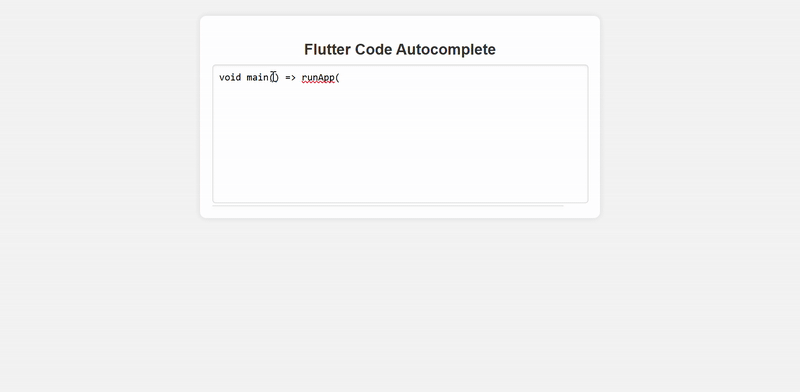

# Automating UI Development with AI-Driven Code Completion


This repository contains the code, models, and a demo for an AI-driven system designed to automate code completion, test generation, and debugging for UI-based programming languages like Flutter (Dart) and Kotlin.

### **1. `Model_Training.ipynb`**
This Jupyter Notebook contains a basic model trained on a subset of **140k records** from the collected dataset. The model is fine-tuned on **CodeT5-small** for code autocompletion. 
- The notebook demonstrates **data processing, tokenization, and model fine-tuning** for generating UI-related code snippets.
- A full-scale model training on **CodeT5-base** using the entire dataset is planned for future iterations.

### **2. `UI/` (Frontend for Demo)**
A simple UI to demonstrate the code generation capabilities of the fine-tuned model.
- Users can input partial code and receive AI-generated completions.
- Built using **Flutter** for an intuitive developer experience.

### **3. `rest_api/` (REST API for Model Access)**
A FastAPI-based backend that serves the fine-tuned model via a REST API.
- Accepts input code and returns predicted completions.
- Supports **batch processing** for improved performance.

### **4. Fine-Tuned Model & Processed Dataset**
This file contains links to:
- The **fine-tuned model**(trained weights, tokenizer, and inference script): [Download Here](https://drive.google.com/drive/folders/1_TqruZSd8g7Kg8KBuPtXv8lkkYtYy6cP?usp=sharing)
- The **processed dataset**(tokenized and structured dataset for sequence to sequence learning): [Download Here](https://drive.google.com/drive/folders/1WwKinqK4JThx_0bmHS5aoeRybzA065kv?usp=drive_link)

## **Setup & Installation**

### **1. Clone the Repository**
```bash
git clone https://github.com/yourusername/your-repo.git
cd your-repo
```

### **2. Install Dependencies**
Ensure you have Python installed, then run:
```bash
pip install -r requirements.txt
```
For Jupyter Notebook usage:
```bash
pip install notebook
```

### **3. Download Pretrained Model (Optional)**
Instead of training from scratch, you can directly download the **fine-tuned model** from the provided link in `Links.md` and place it in the appropriate directory for immediate use.

### **4. Run the Model Training Notebook**
To train or fine-tune the model on your dataset:
1. Open Jupyter Notebook:
   ```bash
   jupyter notebook
   ```
2. Run `Model_Training.ipynb` step by step.

### **5. Start the REST API**
To serve the trained model via REST API:
```bash
cd rest_api
uvicorn main:app --host 0.0.0.0 --port 8000
```
The API will be accessible at `http://localhost:8000`.

### **6. Run the Frontend Demo**
Navigate to the `UI/` directory and run:
```bash
flutter run
```
This will launch the UI where you can test real-time code generation.

---

## **Future Work**
- Expanding training to **CodeT5-base** with the full dataset.
- Optimizing model inference for **lower latency and improved accuracy**.
- Enhancing UI for a more **seamless developer experience**.
- Adding more models for **Kotlin and Flutter** for additional tasks such as **test case generation, prompt-to-code translation, and bug detection**.
- Exploring **multi-model architectures** to improve code **understanding and generation for different UI-based frameworks**.
- Integrating **automated CI/CD pipelines** for continuous model improvement and real-world validation.

---

## **Contributions**
Contributions are welcome! If you find bugs, have feature requests, or want to improve the model, feel free to:
- Open an **issue** with detailed information.
- Submit a **pull request** with your improvements.
- Discuss ideas in the repository’s **discussions** section.

For major changes, please propose ideas via an issue before submitting code changes. Thank you for contributing! 🚀

